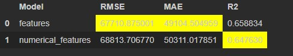

## Предсказание стоимости жилья

***Цель исследования: обучить модель линейной регрессии на данных о жилье в Калифорнии в 1990 году. На основе данных нужно предсказать медианную стоимость дома в жилом массиве — median_house_value.***

_В проекте нам нужно обучить модель линейной регрессии на данных о жилье в Калифорнии в 1990 году. На основе данных нужно предсказать медианную стоимость дома в жилом массиве. Необходимо обучить модель и сделать предсказания на тестовой выборке. Для оценки качества модели будем использовать метрики RMSE, MAE и R2._


##Итоги исследования:
```
Нами проведено обучение 2-х моделей, с использованием 2-х наборов признаков:
всех признаков датасета (all_features);
только числовых признаков датасета (numerical_features_scaled).
По итогам обучения можно сделать вывод, что отличия моделей потенциально не значимы и обе модели практически одинаково предсказывают целевой признак.
```



##Стек технологий:

___________________________
```
pandas, matplotlib, numpy, seaborn, pyspark
```
pandas, matplotlib, numpy, seaborn, pyspark